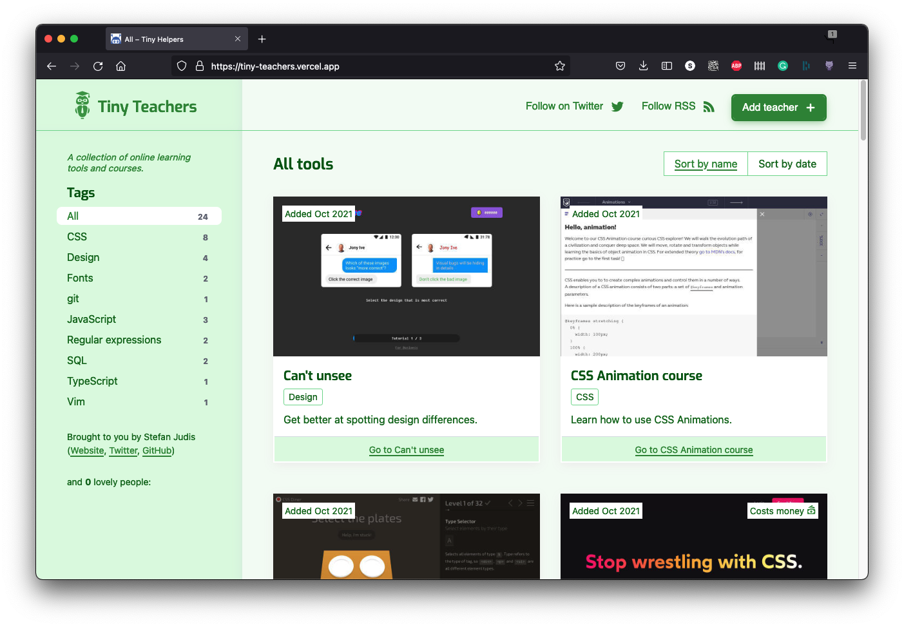

# tiny-teachers.dev

> A collection of online learning tools and courses.



## Contributing

Make sure you have a recent version of [Node.js installed](https://nodejs.org/en/) (we recommend at least version `v12.14.`). After installing Node.js you'll have the `node` but also the [`npm`](https://www.npmjs.com/) command available. npm is Node.js' package manager.

**Additionally, please have a look at the [CONTRIBUTING.md](./CONTRIBUTING.md) including further information about what counts as a tiny helper.**

Fork and clone this repository. Head over to your terminal and run the following command:

```
git clone git@github.com:[YOUR_USERNAME]/tiny-teachers.git
cd tiny-teachers
npm ci
npm run teacher:add
```

### Add a new teacher

`npm run teacher:add` will ask a few questions and create a file in `helpers/`.
Commit the changes and [open a pull request](https://help.github.com/en/github/collaborating-with-issues-and-pull-requests/creating-a-pull-request).

### Run the project locally

This project uses Vercel's routing configuration. The `/` route doesn't work locally. To start, navigate to `localhost:8080/home/` after running `npm run dev`.

```
npm run dev
```
